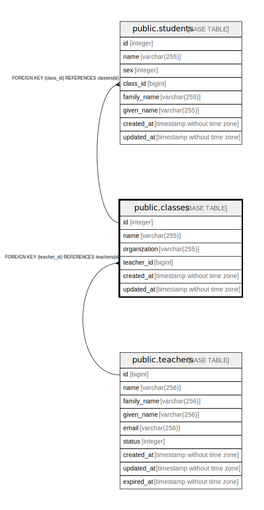

# public.classes

## Description

## Columns

| Name | Type | Default | Nullable | Children | Parents | Comment |
| ---- | ---- | ------- | -------- | -------- | ------- | ------- |
| id | bigint | nextval('classes_id_seq'::regclass) | false | [public.students](public.students.md) [public.surveys](public.surveys.md) |  |  |
| proxy_uuid | character(36) |  | false |  |  |  |
| name | varchar(255) |  | false |  |  |  |
| teacher_id | bigint |  | true |  | [public.teachers](public.teachers.md) |  |
| created_at | timestamp without time zone | now() | false |  |  |  |
| updated_at | timestamp without time zone | now() | false |  |  |  |

## Constraints

| Name | Type | Definition |
| ---- | ---- | ---------- |
| classes_teacher_id_fkey | FOREIGN KEY | FOREIGN KEY (teacher_id) REFERENCES teachers(id) |
| classes_pkey | PRIMARY KEY | PRIMARY KEY (id) |
| classes_proxy_uuid_key | UNIQUE | UNIQUE (proxy_uuid) |

## Indexes

| Name | Definition |
| ---- | ---------- |
| classes_pkey | CREATE UNIQUE INDEX classes_pkey ON public.classes USING btree (id) |
| classes_proxy_uuid_key | CREATE UNIQUE INDEX classes_proxy_uuid_key ON public.classes USING btree (proxy_uuid) |

## Relations

---

> Generated by [tbls](https://github.com/k1LoW/tbls)
