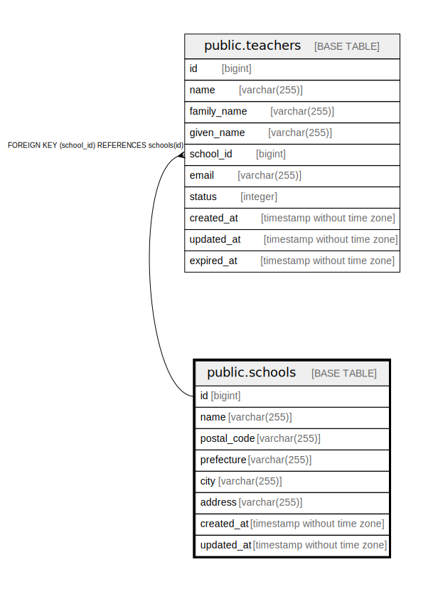

# public.schools

## Description

## Columns

| Name | Type | Default | Nullable | Children | Parents | Comment |
| ---- | ---- | ------- | -------- | -------- | ------- | ------- |
| id | bigint | nextval('schools_id_seq'::regclass) | false | [public.teachers](public.teachers.md) |  |  |
| name | varchar(255) |  | false |  |  |  |
| postal_code | varchar(255) |  | true |  |  |  |
| prefecture | varchar(255) |  | true |  |  |  |
| city | varchar(255) |  | true |  |  |  |
| address | varchar(255) |  | true |  |  |  |
| created_at | timestamp without time zone | now() | false |  |  |  |
| updated_at | timestamp without time zone | now() | false |  |  |  |

## Constraints

| Name | Type | Definition |
| ---- | ---- | ---------- |
| schools_pkey | PRIMARY KEY | PRIMARY KEY (id) |

## Indexes

| Name | Definition |
| ---- | ---------- |
| schools_pkey | CREATE UNIQUE INDEX schools_pkey ON public.schools USING btree (id) |

## Relations

---

> Generated by [tbls](https://github.com/k1LoW/tbls)
