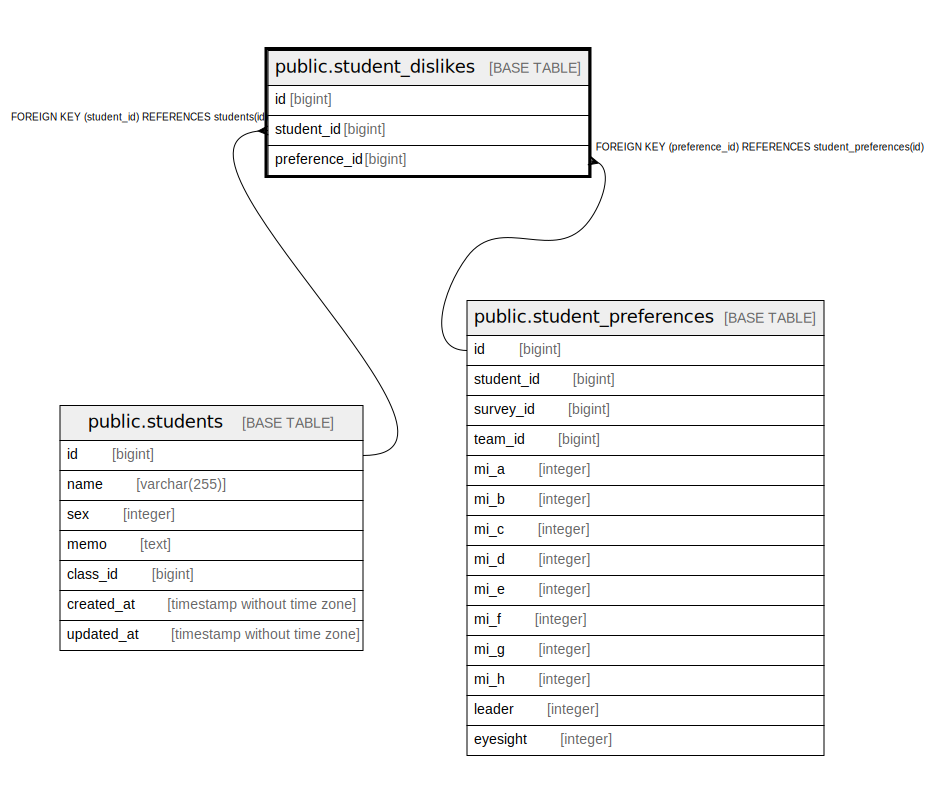

# public.student_dislikes

## Description

## Columns

| Name | Type | Default | Nullable | Children | Parents | Comment |
| ---- | ---- | ------- | -------- | -------- | ------- | ------- |
| id | bigint |  | false |  |  |  |
| student_id | bigint |  | true |  | [public.students](public.students.md) |  |
| preference_id | bigint |  | true |  | [public.student_preferences](public.student_preferences.md) |  |

## Constraints

| Name | Type | Definition |
| ---- | ---- | ---------- |
| student_dislikes_student_id_fkey | FOREIGN KEY | FOREIGN KEY (student_id) REFERENCES students(id) |
| student_dislikes_preference_id_fkey | FOREIGN KEY | FOREIGN KEY (preference_id) REFERENCES student_preferences(id) |
| student_dislikes_pkey | PRIMARY KEY | PRIMARY KEY (id) |

## Indexes

| Name | Definition |
| ---- | ---------- |
| student_dislikes_pkey | CREATE UNIQUE INDEX student_dislikes_pkey ON public.student_dislikes USING btree (id) |

## Relations

---

> Generated by [tbls](https://github.com/k1LoW/tbls)
