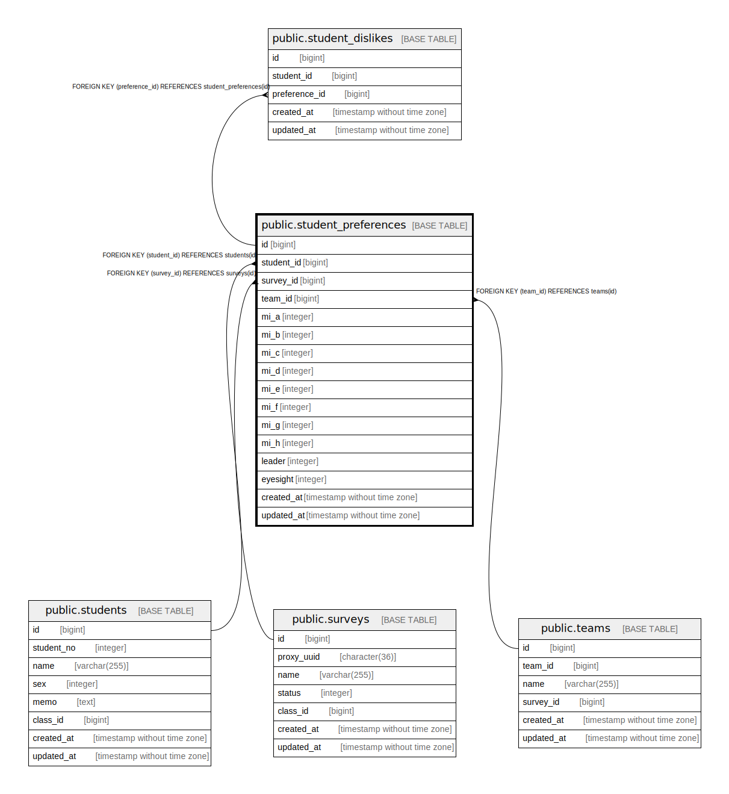

# public.student_preferences

## Description

## Columns

| Name | Type | Default | Nullable | Children | Parents | Comment |
| ---- | ---- | ------- | -------- | -------- | ------- | ------- |
| id | bigint |  | false | [public.student_dislikes](public.student_dislikes.md) |  |  |
| student_id | bigint |  | true |  | [public.students](public.students.md) |  |
| survey_id | bigint |  | true |  | [public.surveys](public.surveys.md) |  |
| team_id | bigint |  | true |  | [public.teams](public.teams.md) |  |
| mi_a | integer |  | false |  |  |  |
| mi_b | integer |  | false |  |  |  |
| mi_c | integer |  | false |  |  |  |
| mi_d | integer |  | false |  |  |  |
| mi_e | integer |  | false |  |  |  |
| mi_f | integer |  | false |  |  |  |
| mi_g | integer |  | false |  |  |  |
| mi_h | integer |  | false |  |  |  |
| leader | integer |  | false |  |  |  |
| eyesight | integer |  | false |  |  |  |

## Constraints

| Name | Type | Definition |
| ---- | ---- | ---------- |
| student_preferences_student_id_fkey | FOREIGN KEY | FOREIGN KEY (student_id) REFERENCES students(id) |
| student_preferences_survey_id_fkey | FOREIGN KEY | FOREIGN KEY (survey_id) REFERENCES surveys(id) |
| student_preferences_team_id_fkey | FOREIGN KEY | FOREIGN KEY (team_id) REFERENCES teams(id) |
| student_preferences_pkey | PRIMARY KEY | PRIMARY KEY (id) |

## Indexes

| Name | Definition |
| ---- | ---------- |
| student_preferences_pkey | CREATE UNIQUE INDEX student_preferences_pkey ON public.student_preferences USING btree (id) |

## Relations

---

> Generated by [tbls](https://github.com/k1LoW/tbls)
