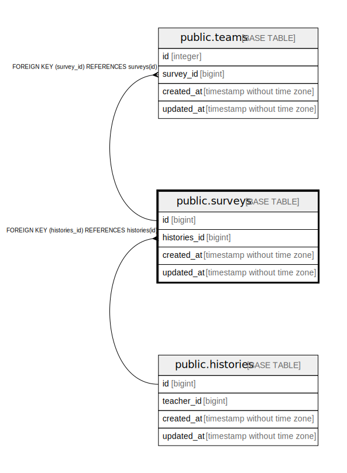

# public.surveys

## Description

## Columns

| Name | Type | Default | Nullable | Children | Parents | Comment |
| ---- | ---- | ------- | -------- | -------- | ------- | ------- |
| id | bigint | nextval('surveys_id_seq'::regclass) | false | [public.teams](public.teams.md) [public.student_preferences](public.student_preferences.md) |  |  |
| proxy_uuid | character(36) |  | false |  |  |  |
| name | varchar(255) |  | false |  |  |  |
| status | integer | 0 | false |  |  |  |
| class_id | bigint |  | true |  | [public.classes](public.classes.md) |  |
| created_at | timestamp without time zone | now() | false |  |  |  |
| updated_at | timestamp without time zone | now() | false |  |  |  |

## Constraints

| Name | Type | Definition |
| ---- | ---- | ---------- |
| surveys_class_id_fkey | FOREIGN KEY | FOREIGN KEY (class_id) REFERENCES classes(id) |
| surveys_pkey | PRIMARY KEY | PRIMARY KEY (id) |
| surveys_proxy_uuid_key | UNIQUE | UNIQUE (proxy_uuid) |

## Indexes

| Name | Definition |
| ---- | ---------- |
| surveys_pkey | CREATE UNIQUE INDEX surveys_pkey ON public.surveys USING btree (id) |
| surveys_proxy_uuid_key | CREATE UNIQUE INDEX surveys_proxy_uuid_key ON public.surveys USING btree (proxy_uuid) |

## Relations

---

> Generated by [tbls](https://github.com/k1LoW/tbls)
