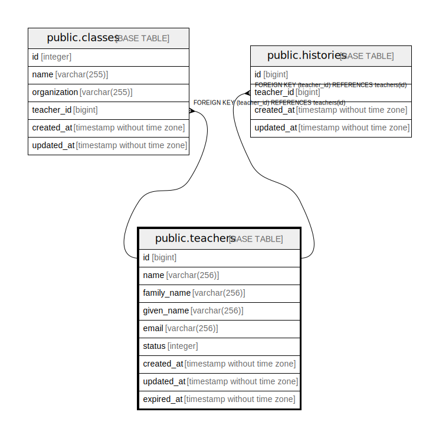

# public.teachers

## Description

## Columns

| Name | Type | Default | Nullable | Children | Parents | Comment |
| ---- | ---- | ------- | -------- | -------- | ------- | ------- |
| id | bigint | nextval('teachers_id_seq'::regclass) | false | [public.classes](public.classes.md) |  |  |
| name | varchar(255) |  | false |  |  |  |
| family_name | varchar(255) |  | true |  |  |  |
| given_name | varchar(255) |  | true |  |  |  |
| school_id | bigint |  | true |  | [public.schools](public.schools.md) |  |
| email | varchar(255) |  | true |  |  |  |
| status | integer |  | false |  |  |  |
| created_at | timestamp without time zone | now() | false |  |  |  |
| updated_at | timestamp without time zone | now() | false |  |  |  |
| expired_at | timestamp without time zone |  | true |  |  |  |

## Constraints

| Name | Type | Definition |
| ---- | ---- | ---------- |
| teachers_school_id_fkey | FOREIGN KEY | FOREIGN KEY (school_id) REFERENCES schools(id) |
| teachers_pkey | PRIMARY KEY | PRIMARY KEY (id) |

## Indexes

| Name | Definition |
| ---- | ---------- |
| teachers_pkey | CREATE UNIQUE INDEX teachers_pkey ON public.teachers USING btree (id) |

## Relations

---

> Generated by [tbls](https://github.com/k1LoW/tbls)
