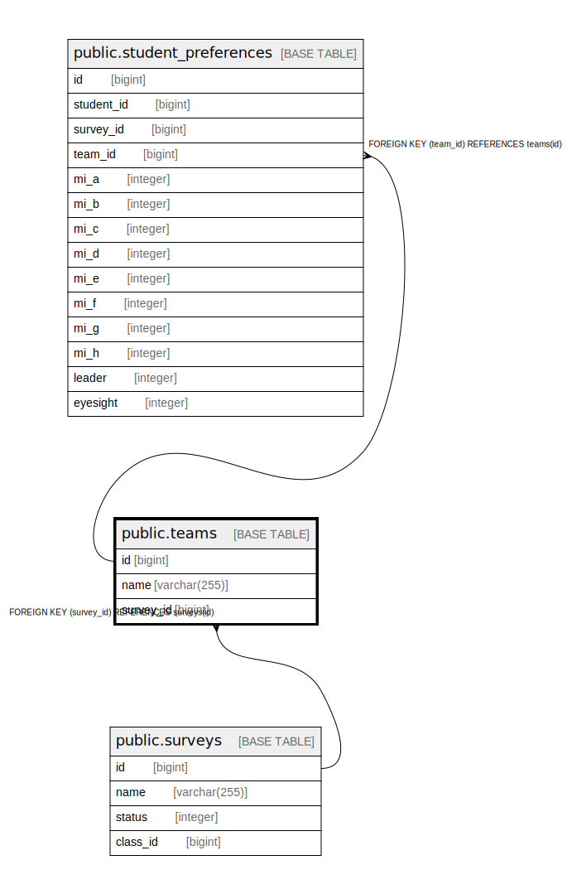

# public.teams

## Description

## Columns

| Name | Type | Default | Nullable | Children | Parents | Comment |
| ---- | ---- | ------- | -------- | -------- | ------- | ------- |
| id | bigint | nextval('teams_id_seq'::regclass) | false | [public.student_preferences](public.student_preferences.md) |  |  |
| team_id | bigint |  | false |  |  |  |
| name | varchar(255) |  | false |  |  |  |
| survey_id | bigint |  | true |  | [public.surveys](public.surveys.md) |  |
| created_at | timestamp without time zone | now() | false |  |  |  |
| updated_at | timestamp without time zone | now() | false |  |  |  |

## Constraints

| Name | Type | Definition |
| ---- | ---- | ---------- |
| teams_survey_id_fkey | FOREIGN KEY | FOREIGN KEY (survey_id) REFERENCES surveys(id) |
| teams_pkey | PRIMARY KEY | PRIMARY KEY (id) |
| teams_survey_id_team_id_key | UNIQUE | UNIQUE (survey_id, team_id) |

## Indexes

| Name | Definition |
| ---- | ---------- |
| teams_pkey | CREATE UNIQUE INDEX teams_pkey ON public.teams USING btree (id) |
| teams_survey_id_team_id_key | CREATE UNIQUE INDEX teams_survey_id_team_id_key ON public.teams USING btree (survey_id, team_id) |

## Relations

---

> Generated by [tbls](https://github.com/k1LoW/tbls)
